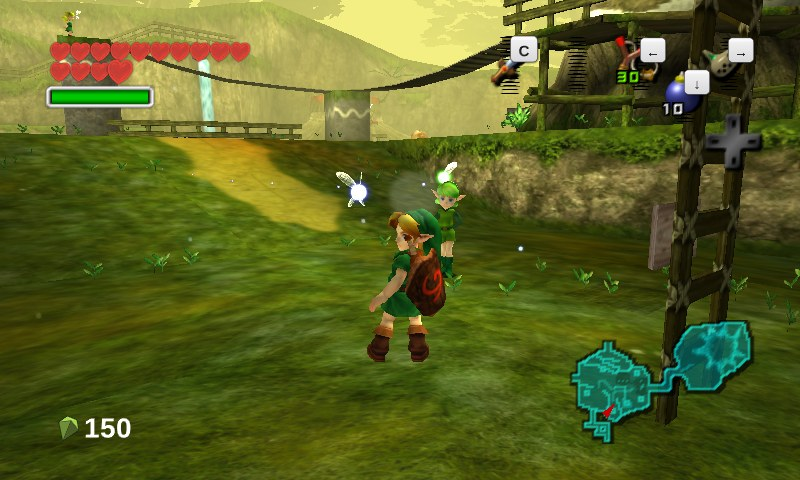
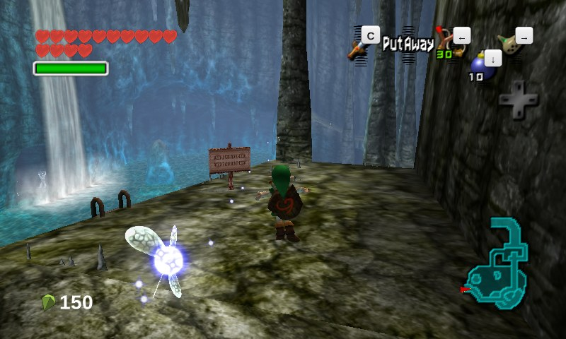
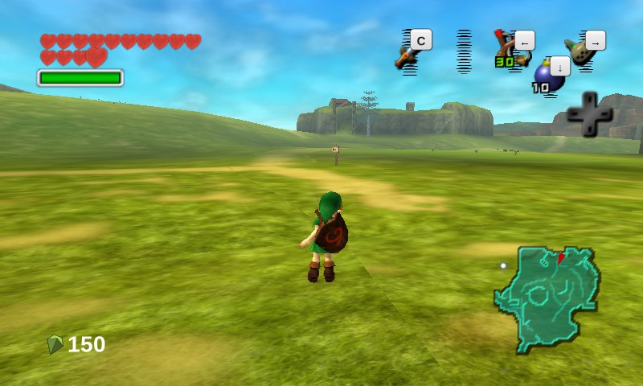
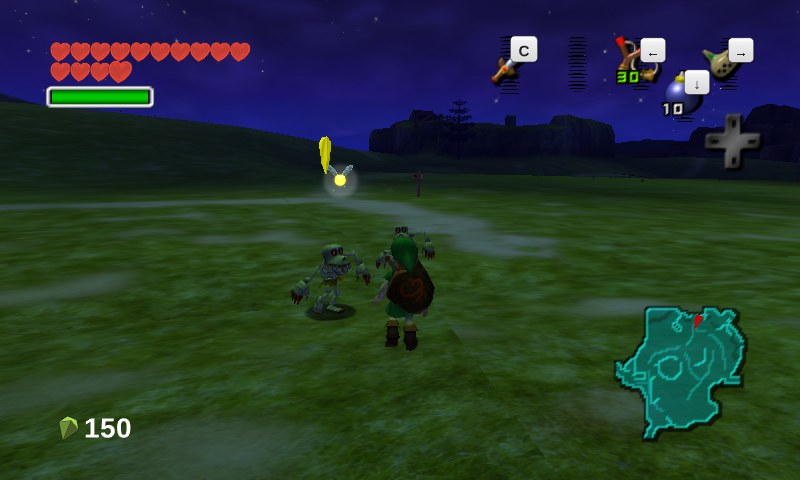
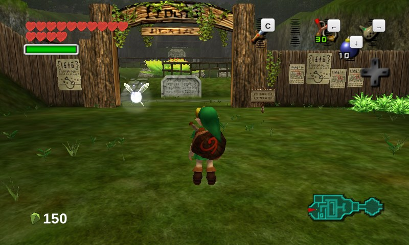
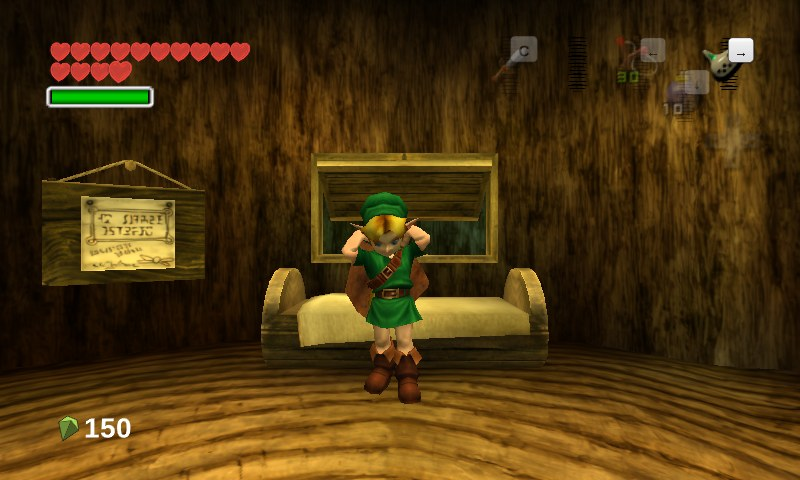

# Zelda3D

**Ocarina of Time 3D and Majora's Mask 3D, rendered on PC.**

Zelda3D runs the Nintendo 64 decompilations as the game-logic spine and replaces what you
*see* with the 3DS remakes' own assets and behaviour — models, animations, scene geometry,
collision, cameras and lighting read straight from the 3DS ROMs.

| branch | base engine | assets |
|---|---|---|
| **soh3d** | [Ship of Harkinian](https://github.com/HarbourMasters/Shipwright) (OoT) | Ocarina of Time 3D |
| **2ship3d** | [2 Ship 2 Harkinian](https://github.com/HarbourMasters/2ship2harkinian) (MM) | Majora's Mask 3D |

You supply your own ROMs. None are included, and none ever will be.

---

## Running

Install `uv` and the native C++/SDL dependencies for your platform, then supply your own OoT and MM
inputs: decrypted OoT3D and MM3D `.3ds` files plus the corresponding N64 ROMs. Name them with
`ZELDA3D_OOT3D_ROM`, `ZELDA3D_OOT_ROM`, `ZELDA3D_MM3D_ROM`, and `ZELDA3D_MM_ROM` in the process
environment or a gitignored `.env`. An optional OoT Master Quest ROM is independent and uses
`ZELDA3D_OOT_MQ_ROM`. Canonical repo-root names (`oot3d.3ds`, `oot.z64`, `oot-mq.z64`, `mm3d.3ds`,
and `mm.z64`) work without configuration; other repo-root drop-ins are identified by their ROM
metadata and ambiguous matches are refused.

```sh
./run.sh
```

The no-argument path provisions the locked Python environment and the two pinned public build
dependencies, extracts both games' runtime archives, configures with the compiler selected by the
user or platform, builds the unified launcher and both game cores, and opens the game chooser. A
recursive clone or manual submodule step is not required. It does not initialize the private decomp
references or require Ghidra or either decomp repository's analysis tooling. Run
`./run.sh --bootstrap-check` for a non-building cold-path check; missing native packages are reported
with the platform's exact install command.

---

## Screenshots

Captured from the running build — 3DS models, scene geometry and lighting.

| Kokiri Forest | Zora's Domain |
|---|---|
|  |  |

| Hyrule Field | Hyrule Field at night |
|---|---|
|  |  |

| Kakariko Graveyard | Link's House |
|---|---|
|  |  |

---

## How it works

The N64 decompilation stays in charge of game logic — actor updates, state machines, collision
queries, save data. Zelda3D hooks the draw and asset seams so that a scene, an actor or an
animation resolves to its 3DS counterpart instead of the N64 original, falling back to N64
content where no 3DS equivalent exists.

Getting that to *match* is the actual work, and it is done against ground truth rather than by
eye: an **embedded Azahar core** runs the real 3DS game in-process alongside the port, so any
frame, actor table, animation playhead or GPU register can be compared directly. Parity claims
in this repo are expected to cite a measurement.

Some of what that has produced:

- **PICA200 fragment pipeline** — per-material multi-stage TEV combiners, multi-texture, and
  the 3DS's distance-fog window and colour, driven from each scene's own ZSI environment data.
- **Per-vertex lighting semantics** — including that the hardware saturates vertex colour
  *before* interpolation, which single detail accounted for a visible brightness error.
- **CMB / CSAB / ZAR / ZSI** asset readers, plus `.faceb` — an undocumented Grezzo facial
  keyframe format reverse-engineered here to drive Link's eyes and mouth.
- **Camera values** lifted wholesale from the 3DS binary's own settings table.

## Project layout

- `Shipwright/` — vendored OoT engine (Ship of Harkinian) with the `zelda3d/` layer inside it
- `2ship/` — vendored MM engine (2 Ship 2 Harkinian) with its own `zelda3d/` layer
- `Shipwright/cmb3d/` — 3DS asset readers (CMB, CSAB, ZAR, ZSI, CMAB, faceb)
- `tools/` — build, capture, and the oracle harness + parity tooling
- `oot3d-decomp/`, `mm3d-decomp/` — reverse-engineering notes and derived C (submodules)
- `docs/` — architecture, [codemap](docs/codemap.md), [parity map](docs/parity-map.md),
  [RE frontier](docs/re-frontier.md)

## Status

Actively in development, and not a finished product. Rendering parity is measured
scene-by-scene rather than assumed; `docs/parity-map.md` records what is confirmed at parity
and `docs/re-frontier.md` records what is still reverse-engineering debt.

## Licence

GPL-3.0, inherited from the engines this builds on. Zelda, Ocarina of Time and Majora's Mask are trademarks of Nintendo; this
project is unaffiliated with and unendorsed by Nintendo, ships no game assets, and requires
that you own the games it runs.
