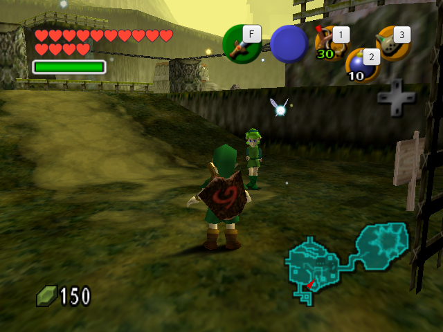
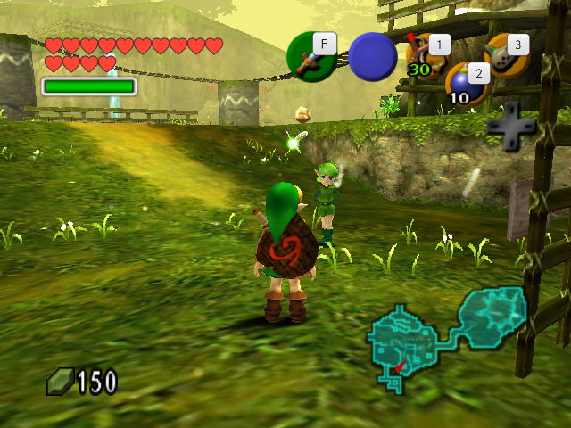
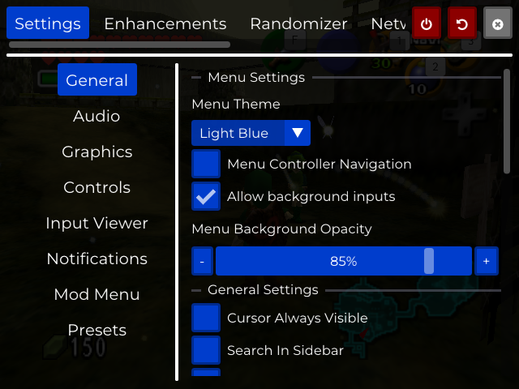

# SOH CURSOR FPS V3 + OoT3D full build

This branch combines the full Ship of Harkinian menu/runtime with the OoT3D render layer and the
controller cursor behavior from **SOH CURSOR FPS V3**. It is one build with a persistent graphics
selector; Original SoH and OoT3D are not separate executables or separate installs.

## Separate install and save continuity

The eventual Xbox package must use a new package identity, so it installs beside
**SOH CURSOR FPS V3** and cannot overwrite that app or its LocalState. A separate identity also
means Windows/Xbox isolates the two save directories; the new app cannot silently read the old
package's files.

To carry progress forward, stop both apps and use Device Portal's file explorer to copy the entire
`Save` directory (including `global.sav` and every `fileN.sav`) from the V3 package's
`LocalState` into the new package's `LocalState`. Keep the original copy until the migrated save
has been opened and saved successfully in the new app. The graphics and HD-pack toggles themselves
never rewrite or convert a save.

## Controls

| Input | Result |
|---|---|
| Hold **L3 + R3** for 350 ms | Toggle V3 controller-cursor mode; stick-clicks never leak into gameplay |
| Right stick, cursor mode on | Move the system cursor with the V3 deadzone/rate |
| **A**, cursor mode on | Left mouse click, including click-and-drag |
| **View/Back** or **F1** | Toggle the complete SoH settings menu |
| **Menu/Start** or **Escape** | Toggle the compact in-game RmlUi menu |

The two menus are mutually exclusive and both block game input while open. Cursor mode starts off
on every launch, matching V3. Its enable/disable rumble, 1.6-second confirmation toast, crosshair,
6500 right-stick deadzone, 1150-pixel/second maximum speed, and controller-input suppression match
the recovered V3 SDL proxy. If a controller disconnects while holding synthetic left-click, this
build additionally releases the click so the UI cannot remain stuck.

The live FPS control is under **Settings → Graphics → Current FPS**. **Show FPS Overlay** controls
SoH's live statistics/FPS window.

## Graphics toggle

Open **Settings → Graphics → Graphics Mode** and choose:

- **Original SoH** — normal N64/SoH drawing.
- **Ocarina of Time 3D** — all available OoT3D scenes, models, animations, textures, lighting,
  camera behavior, and collision replacements.

The choice is saved. During gameplay, changing it starts a black fade and reloads the current
entrance. The new mode is committed only in the next `Play_Init`, after the old scene and collision
have been destroyed. This prevents mixed N64/OoT3D geometry or collision in one live scene.
Persistent save/game state remains intact; temporary room/actor state resets as it does on an
ordinary entrance reload.

**Alternate Assets remains a separate setting.** In OoT3D mode it can still affect the original SoH
assets used by the HUD and by per-object N64 fallbacks; it does not replace the authored textures
inside an OoT3D CMB model.

## Private OoT3D asset source

The build does not distribute Nintendo ROM data. OoT3D mode reads either the user's own extracted
RomFS directory (`oot3d-romfs`) or a decrypted Ocarina of Time 3D cartridge image (`oot3d.3ds`).
An encrypted retail `.3ds` is deliberately rejected; use the extracted RomFS produced from that
dump instead. Resolution order is:

1. `ZELDA3D_OOT3D_ROMFS` extracted-directory override, when explicitly set;
2. `ZELDA3D_OOT3D_ROM` decrypted-image override, when explicitly set;
3. `E:/soh/oot3d-romfs`, then `E:/soh/oot3d.3ds`, on Xbox/UWP;
4. `oot3d-romfs`, then `oot3d.3ds`, in the SoH app-data directory;
5. the same two names in the application bundle directory;
6. the same two names in the current working directory.

The selector verifies the CCI and required OoT3D RomFS anchors before accepting OoT3D mode. If the
source is missing, encrypted, the wrong title, or damaged, the menu keeps **Original SoH** selected
and displays the exact source error.

Replacement eligibility is checked before suppressing an N64 draw. A bad or absent room, sky
layer, texture, model, or authored animation therefore falls back at that object to the original
SoH asset instead of producing a black scene, white model, bind pose, or invisible actor.

## Normal and Master Quest game data

Normal OoT and Master Quest are provisioned independently. On a private desktop build,
`ZELDA3D_OOT_ROM` names the user's Normal ROM and `ZELDA3D_OOT_MQ_ROM` names the user's Master Quest
ROM. The bootstrap stages read-only links beside the core only for a missing edition. Startup
validates each candidate and creates `oot.o2r` and `oot-mq.o2r` respectively; an existing archive is
preserved, and having one edition no longer prevents the other from being generated. Once both
archives exist, later boots do not scan or extract either ROM again.

The extractor also produces stable resource payloads. ZAPD sorts recursive inputs, initializes
serialized skin fields, and copies the SetMesh command byte from the ROM instead of writing
uninitialized storage. Two independent cold extractions produced identical filename, size, CRC32,
and decompressed SHA-256 manifests for all 38,526 Normal and 35,352 Master Quest resources. The
outer ZIP hashes may still differ because ZIP member timestamps record when each archive was made.

The AppX stays ROM-free. The owner uploads derived `oot.o2r` and/or `oot-mq.o2r` through Device
Portal to `LocalState\soh`, where the existing app-directory search resolves them before the
read-only install directory. This avoids both first-boot extraction and redistribution of private
game data. Neither a raw ROM nor either derived archive is part of source or Actions artifacts.

The local SoH Randomizer uses the same two loaded archives. Its Normal/MQ-per-dungeon choices do not
change with Graphics Mode: logic, seed generation, spoiler output, and saves stay SoH-owned while
the selected Original/OoT3D renderer draws the result.

## Optional OoT3D HD texture pack

The renderer accepts Citra/Azahar legacy-hash texture packs as either extracted folders or their
original ZIP/Zip64 archives. The ZIP is indexed and read in place, so Henriko Magnifico's
multi-gigabyte OoT3D 4K pack does not need to be extracted, converted, or embedded in the build.

Copy the archive into the app-data `texture-packs` directory shown under
**Settings → Graphics → OoT3D HD Texture Pack**, then enable it or select **Rescan Installed Texture
Pack**. Enabling, disabling, or rescanning during OoT3D gameplay uses the same safe black
same-entrance reload boundary as Graphics Mode; Original mode applies the change immediately.
Model, atlas, HUD, and renderer texture caches all observe the loader generation and are rebuilt
together. Save data, current seed configuration, and the local SoH Randomizer are unchanged.

As of 2026-09-04, v4.0 is the latest public version listed on
[the author's official page](https://www.henrikomagnifico.com/zelda-ocarina-of-time-3d-4k);
v5.0 is supporter-only early access. Neither the pack nor Nintendo data is redistributed here.
Complete desktop and future Device Portal steps are in
[the texture-pack guide](oot3d-hd-texture-packs.md).

## SoH setting behavior

Restoring the complete SoH menu restores Settings, Enhancements, Randomizer, Network, and Dev Tools;
presets and their registered initialization callbacks run normally. Settings are not globally
disabled in OoT3D mode. Their honest scopes are:

| Setting family | Status in both graphics modes |
|---|---|
| Saves, autosave, boot, language, gameplay, fixes, timesavers, difficulty, randomizer, cheats | Working; these change the shared SoH game/runtime, not the selected model source |
| Controller bindings, input viewer, menu navigation, notifications | Working; V3 cursor ownership is arbitrated with both menus |
| Master/music/fanfare/SFX volume and audio backend | Working |
| Internal resolution, interpolation FPS, refresh-rate matching, aspect/layout, fullscreen where the platform permits it | Working |
| HUD/UI, text, minimap, accessibility effects | Working |
| Alternate Assets | Independent; applies to the SoH/N64 asset layer and fallbacks |
| OoT3D HD Texture Pack | Independent toggle; direct ZIP/folder loading for matching OoT3D textures, with transactional live cache reload |
| Texture Filter | Original SoH and N64 fallbacks; OoT3D CMBs keep their authored sampler state |
| Translate Title Screen | Original/fallback title only; authored OoT3D title text is unchanged |
| N64 display-list model options such as LOD/equipment/pause-model choices | Apply to Original SoH and any N64 fallback; authored CMB replacements retain their own mesh/material state |
| Disable Fixed Camera | Available when OoT3D mode or SoH's 3D pre-rendered-scene option is selected |
| MSAA | Visibly unavailable in the current SDL3 GPU renderer; Internal Resolution remains available |
| Runtime VSync switch | Visibly unavailable in the current SDL3 GPU renderer; FPS/refresh matching remains available |
| Multi-window ImGui viewports | Visibly unavailable in the single-window SDL3 GPU/console interface |
| Fix Vanishing Paths depth-bias selector | Visibly unavailable because the SDL3 GPU depth-bias path is fixed |
| Legacy Gfx Debugger | Visibly unavailable because it depends on the removed OpenGL renderer; other developer tools remain available |
| Sail, Crowd Control, Anchor networking | Visibly unavailable; the current SDL compatibility layer performs no network I/O and auto-connect is suppressed |

“Working correctly” here means a setting either reaches its real runtime consumer, is explicitly
scoped to the N64/fallback side, or is visibly unavailable with the reason shown. The menu does not
offer known no-op renderer/network controls as if they worked.

## Verification and packaging status

- `soh_core`: clean optimized Linux build after the mode, menu, cursor, asset-source, and fallback changes.
- SDL2/OpenGL `soh_core`: clean optimized Linux rebuild with the current-feature OoT3D model and
  native-HUD backend linked into libultraship; `ldd -r` reports no unresolved symbols.
- Live software-OpenGL smoke: the production model shader compiles in a real Mesa 4.5 compatibility
  context, renders a model triangle, restores sentinel GL program/texture state, then renders the
  native HUD at the correct ordering point. The source-only fixture is
  `tools/zelda3d_opengl_smoke.cpp`.
- The SDL2 launcher loads the OoT and MM cores together under `RTLD_NOW | RTLD_LOCAL`; both report
  ABI 1 and all three checked decomp symbols remain private per core.
- `zelda3d_app`: complete optimized Linux launcher build passes.
- `tools/test_cursor_fps_v3_full_build.py`: 18/18 contract tests pass.
- `tools/test_texture_pack_loader.py`: folder/ZIP loading, manifests, legacy hashes, decode
  orientation, toggling, validation failures, and cache-generation behavior pass.
- ROM provisioning: 13/13 focused tests pass, including explicit independent Normal/MQ inputs.
- Scene headers: 101/101 present in the OoT3D source.
- Literal scene asset references: 329/329 present.
- Live software-Vulkan launch reaches Kokiri Forest with the full settings tree initialized.
- Live `Original SoH → Ocarina of Time 3D → Original SoH` switching passes in one process. Each
  change performs a same-entrance teardown/reload; the OoT3D pass loaded scene collision, a
  21-group/22-texture room, Link's 55-group/44-texture model, facial frames, NPCs, props, and
  animations from the extracted source.
- Live compact/full menu arbitration passes in both directions. A physical Xbox controller pass is
  still part of the eventual UWP target verification.
- Live texture-pack ZIP discovery and status pass. In one gameplay process,
  `off → on → rescan` each completed through a safe OoT3D scene reload, then the build returned to
  Original mode and shut down cleanly. The fixture was synthetic and redistributable; the external
  Henriko archive itself was not bundled or claimed as test evidence.
- Live dual-ROM cold provisioning passes: two isolated boots independently identified the supplied
  PAL Master Quest and NTSC-U 1.1 Normal ROMs, generated both archives, ZIP-tested and loaded them,
  and produced identical payload manifests across all 73,878 resources. A later normal boot skips
  repeat extraction when both archives exist.
- Live local Randomizer plus OoT3D mode passes: a seed with **MQ Dungeon Setting = Set Number** and
  **MQ Dungeon Count = 12** generated successfully; its spoiler lists all twelve dungeons under
  `masterQuestDungeons`. The final gate seed was
  `full-build-deterministic-dual-rom-mq-final-20260904` (reported hash `672743998`); shutdown
  released 608 GPU handles once and left 0/2 run-scoped pointers.
- Xbox Device Portal package: the ROM-free remote compile/sign pipeline is present. Its first
  full-core WindowsStore attempt proved that boundary invalid. Run 7 validated the replacement
  normal-Windows boundary through configuration and most of the core compile, then found one
  unguarded POSIX timing call in presented-FPS telemetry. That call now uses portable monotonic
  `std::chrono`. The `5eb90001` rerun passed it and continued beyond 2,200 compile-log lines before
  finding two development-REPL POSIX leaks. REPL FPS now uses the same portable clock, while its
  Linux FIFO transport retains ABI-compatible no-op hooks on Windows. Run 9 passed both fixes and
  reached the last authored source batch, where MSVC rejected private `std::vector` HUD helpers that
  had accidentally inherited a file-wide C linkage block. Only the true public HUD ABI now retains
  C linkage. The following rerun compiled all authored source, then its redundant intermediate
  `soh_lib.lib` reached 4,306,883,221 bytes and exceeded MSVC's 4 GiB archive limit. The Xbox core
  now uses an OBJECT library, preserving the complete source/object set while sending it directly
  to `soh_core.dll`; Release also restores `/O2` and omits unshipped compiler debug data. Run 14
  then compiled and linked the entire Windows core successfully in 75 minutes. Its staging step
  failed because the workflow searched the CMake binary tree even though Shipwright's Visual Studio
  property sheet places `soh_core.dll`, its import library, and copied assets in
  `<source>/x64/Release`. The corrected workflow stages that exact directory. WindowsStore wrapper,
  signed AppX, and physical-device execution remain the platform gates.

| Original SoH | OoT3D mode | Full SoH settings |
|---|---|---|
|  |  |  |

### Xbox/UWP packaging boundary

The normal desktop renderer remains SDL3 GPU. The opt-in SDL2/OpenGL target has a real OoT3D model
renderer and native HUD on Linux, alongside the restored SDL2/UWP window seam. Following the proven
SoH UWP architecture, the large engine/game core is compiled as a normal x64 Windows DLL with UWP
source gates; only the small WinRT entry point and AppX deployment project are WindowsStore. The
profile imports a pinned SDL2/libuwp/Mesa depot, uses supported static x64 Windows libraries, folds
libultraship into the one core DLL, excludes desktop WASAPI, legacy StormLib/WinINet, and in-app ROM
extraction, requires the modern `.o2r` archive format, uses
`LocalState\soh`, and builds only the OoT core. GitHub Actions uses three jobs: host archive
generation and the expensive Windows core compile run independently, then a small package job
downloads those two ROM-free artifacts, builds the wrapper, creates an AppX, and signs it with an
ephemeral certificate. The preserved core makes a failed-package retry independent of the
75-minute compile while the internal artifact is retained. New workflow commits restore a stable
cache or download and validate the newest versioned core artifact, then skip dependency installation
and compilation. The validated core is retained for 30 days; a full rebuild remains the fallback
only when no valid preserved core exists. A host-tested staging tool validates
the exact core output, imported SDL2/libuwp/Mesa set, required runtime assets, safe ZIP extraction,
and final unpacked AppX. AppX auditing requires every runtime DLL, the public `soh.o2r`, RmlUi
assets, the expected publisher, and absence of ROMs, private O2Rs, signing keys, import libraries,
PDBs, and staging ZIPs. Only the public `.cer`, Device Portal package, notices, hashes, and Android
instructions are published.

The first run through this split passed core staging, artifact transfer, runtime assembly,
WindowsStore configuration, and wrapper compilation. MakeAppx then returned `0x8007007B` because
root DLLs and `soh.o2r` were assigned literal deployment directory `.`. Visual Studio wrote that dot
component into its package map, where Windows treats it as an invalid directory name. Root payloads
now omit `VS_DEPLOYMENT_LOCATION` entirely, while nested runtime destinations are normalized to
nonempty package directories.

The game target is an OBJECT library in this profile rather than an intermediate static archive.
This is a link-composition change, not content removal: `soh_core.dll` consumes the same complete
`ALL_FILES` object set. A configure-time target-type assertion prevents the 4 GiB librarian failure
from returning late in another mobile-triggered run.

This automation does not itself prove the WindowsStore wrapper or Xbox runtime. The normal-Windows
core link is now remotely proven, but a genuine deliverable still requires a successful wrapper,
AppX build/sign/audit run followed by Device Portal installation, launch, and a physical Xbox
renderer/input pass. A Linux result, renamed package, or unsigned repack is not a valid Device Portal
build and must not be presented as one.
